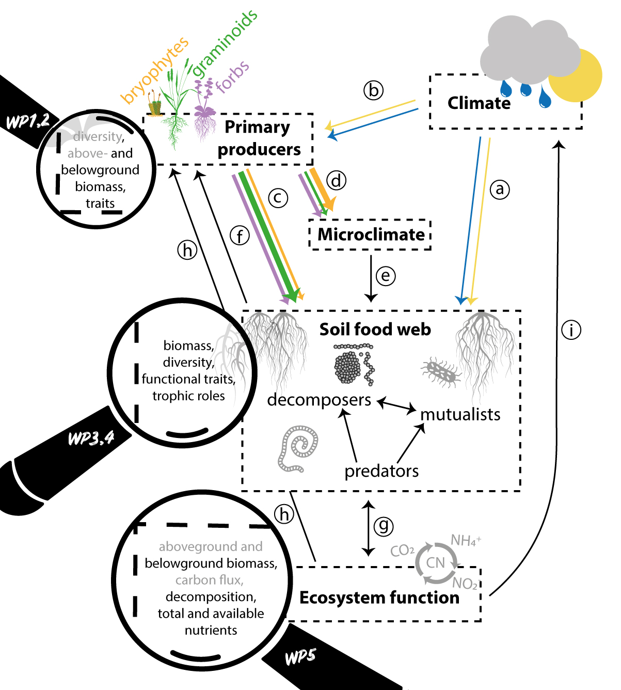

This is the git repository for the FUNDER project and base for the data
paper: xxx et al. (not written yet).

# INTRODUCTION

Climate change alters plant and soil communities, as well as processes
and interactions in the plant-soil food web. These changes pose threats
to biodiversity and key ecosystem functions, such as productivity and
carbon and nutrient cycling. To predict how biodiversity and ecosystem
functioning will respond to future climatic changes, and how these
changes will feed back to the climate system, profound knowledge of
climate impacts on underlying ecological responses, processes,
mechanisms, and interactions in the plant-soil food web is needed.

FUNDER will assess and disentangle the direct effects of climate from
the indirect effects, mediated through biotic interactions, on the
diversity and whole-ecosystem functioning of the plant−soil food web. To
achieve this, we use a powerful macroecological experimental approach to
quantify the impacts of vegetation diversity on interactions and
ecosystem functioning across factorial broad-scale temperature and
precipitation gradients. This will allow us to gain a holistic
understanding of ecosystem responses to climate change, including
non-additive effects, context-dependencies across landscapes,
compensatory effects and climate mismatches that may lead to disruption
of biotic interactions.

Our objectives are to

-   Disentangle direct and indirect climate impacts on plants (WP2),
    soil nematodes and microarthropods (WP3), and soil microbes (WP4),
    and ecosystem (WP1-4),
-   Understand landscape variation and whole-ecosystem consequences of
    indirect effects, and
-   Understand climate feedbacks of the plant-soil food web (WP5).

# METHODS

## Study site

Our study is conducted across the twelve calcareous grassland
experimental sites in the Vestland Climate Grid (VCG), in south-western
Norway. The VCG sites were chosen to fit within a climate grid
reflecting a crossed design encompassing the major bioclimatic variation
in Norway, identified using a combination of topographic maps,
geological maps (NGU) and interpolated maps of summer temperature and
annual precipitation normals 1960-1990 (100 m resolution gridded data,
met.no; see 29 and references therein). The twelve sites are arranged
across three temperature levels (alpine, sub-alpine, boreal) replicated
across each of four levels of precipitation selected to reflect a
difference in mean growing season temperature of ca. 2°C (i.e., the four
warmest months of the year) between temperature levels (6.5°C, 8.5°C,
10.5°C) and a difference in mean annual precipitation of 700 mm between
precipitation levels (700 mm, 1400 mm, 2100 mm, 2800 mm). The final
sites were selected, ensuring that other factors such as grazing regime
and history, bedrock, vegetation type and structure, slope and exposure
were kept as constant as possible among the selected sites30.
Geographical distance between sites is on average 15 km and ranges from
175 km to 650 m.

## Functional group removal experiment (FunCaB)

The functional group removal experiment was designed to examine the
impact of aboveground interactions among the major plant functional
group, graminoids, forbs and bryophytes, on the performance and
functioning of other components of the vegetation and ecosystem. The
experiment consists of eight 25×25 cm plots per site and block, with a
fully factorial combination of removals of three plant functional
groups, with treatments randomized within each block (Figure 1c). The
functional groups are abbreviated as follows: G = graminoids (including
grasses, sedges and rushes), F = forbs (including herbaceous forbs,
pteridophytes, dwarf-shrubs, and small individuals of trees and shrubs),
B = Bryophytes (including mosses, liverworts, and hornworts). Note that
the species are coded by the functional group into which they were
classified in the FunCaB taxon table. The treatments were coded by
functional group removed so that FGB = all plants removed, FB = only
graminoids remaining, GB = only forbs remaining, GF = only bryophytes
remaining, B = graminoids and forbs remaining, F = bryophytes and
graminoids remaining, G = bryophytes and forbs remaining, and C = no
removal controls. In 2016, four extra control (XC) plots were marked per
site for aboveground biomass harvest and ecosystem carbon flux
measurements. This sampling regime gave a total of 384 plots, plus the
additional 48 controls in 2016.

Functional group removals were done once in 2015 (at peak growing season
due to late snowmelt), twice per year in 2016 and 2017 (after the spring
growth and at peak growing season) and annually from 2018 - 2022 (at
peak growing season) as regrowth had declined (see below) and biannual
removals were no longer necessary. At each sampling, all above-ground
biomass of the relevant plant functional group was removed from each
plot as follows: For each plot, all the above-ground parts of the
relevant functional group(s) were removed using scissors and tweezers to
cut the plants at the ground layer. Roots and other below-ground parts
were not removed, and the non-target vegetation and litter were left
intact.

## Data management

### Location of data, metadata and code

The **project description**, an overview of all the **datasets**, and
the **data dictionaries** are in this readme file, available on
[GitHub](https://github.com/Between-the-Fjords/funder_data).

The raw and clean **datasets** from this project are stored and
available on [OSF](https://osf.io/tx9r2/).

All R code for the cleaning the raw data is available on
[GitHub](https://github.com/Between-the-Fjords/funder_data).

### Naming conventions used for the data

| Files or variable | Naming convention                                                                                                                          | Example                                        |
|:------------------|:-------------------------------------------------------------------------------------------------------------------------------------------|:-----------------------------------------------|
| Project           | Project name                                                                                                                               | FUNDER or FunCaB                               |
| Datasets          | Project_Status\_(Experiment)\_Response_Year(s).Extension                                                                                   | FUNDER_clean_microbial_community_2022-2023.csv |
|                   |                                                                                                                                            |                                                |
| siteID            | Name of the site written out fully                                                                                                         | Vikesland, Alrust                              |
| blockID           | Block number as numeric value                                                                                                              | 1, 2, 3, 4                                     |
| treatment         | Treatment of functional group removal indicating which groups have been removed                                                            | F = forbs, G = graminoids, B = Bryophytes      |
| removal_fg        | Functional group that has been removed (only for vegetation data)                                                                          | F = forbs, G = graminoids, B = Bryophytes      |
| species           | Vascular plant taxon names follow for Norway Lid & Lid (Lid J & Lid, 2010). The full taxa is written using genus and species with a blank. | *Leontopodium nivale*                          |
| responses         | Response variables                                                                                                                         | cover, biomass, Reco                           |

## Overview of datasets

This is an overview over all the datasets. They are available on
[OSF](https://osf.io/tx9r2/).

| Response                                  | Time period       | Level   | Project       |
|:------------------------------------------|:------------------|:--------|:--------------|
| **Site level**                            |                   |         |               |
| Coordinates, elevation                    | \-                | Site    | VCG           |
| Geology, Land-use history                 | \-                | Site    | VCG           |
|                                           |                   |         |               |
| **Vegetation**                            |                   |         |               |
| Vascular plant species cover              | 2015 - 2019, 2022 | Plot    | FunCaB        |
| Vascular plant species presence           | 2015 - 2019, 2022 | Subplot | FunCaB        |
| Vegetation height                         | 2015 - 2019, 2022 | Plot    | FunCaB        |
| Functional group biomass                  | 2015 - 2022       | Plot    | FunCaB/FUNDER |
| Total biomass                             | 2022              | Plot    | FUNDER        |
| Reflectance                               | 2021              | Plot    | FunCaB        |
|                                           |                   |         |               |
| Root biomass                              | 2022              | Plot    | FUNDER        |
| Root productivity                         | 2022              | Plot    | FUNDER        |
| Root traits                               | 2022              | Plot    | FUNDER        |
|                                           |                   |         |               |
| Bryophyte composition                     | 2022              | Plot    | FUNDER        |
| Bryophyte presence?                       | 2022              | Plot    | FUNDER        |
| Bryophyte functional traits               | 2022              | Plot    | FUNDER        |
|                                           |                   |         |               |
| **C-flux**                                |                   |         |               |
| Ecosystem carbon fluxes                   | 2015-2018, 2022   | Plot    | FunCaB/FUNDER |
| Litter bag decomposition                  | 2022              | Plot    | FUNDER        |
| Tea bag decomposition                     | 2022              | Plot    | FUNDER        |
|                                           |                   |         |               |
| **Soil food web**                         |                   |         |               |
| Fungal functional groups and diversity    | 2022              | Plot    | FUNDER        |
| Bacteria functional groups and diversity  | 2022              | Plot    | FUNDER        |
| Mycelia production                        | 2022              | Plot    | FUNDER        |
| Mesofauna functional groups and diversity | 2022              | Plot    | FUNDER        |
| Mesofauna abundance and biomass           | 2022              | Plot    | FUNDER        |
|                                           |                   |         |               |
| **Soil**                                  |                   |         |               |
| C and N stocks                            | 2022              | Plot    | FUNDER        |
| Available nutrients                       | 2022              | Plot    | FUNDER        |
| Soil depth                                | 2022              | Plot    | FUNDER        |
|                                           |                   |         |               |
| **Climate**                               |                   |         |               |
| Soil temperature and moisture             | 2022              | Plot    | FUNDER        |
| Soil temperature and moisture             | 2015-2017         | Plot    | FunCaB        |
| Climate                                   | 2009-2022         | Site    | VCG           |

## Methods

## Data dictionary
